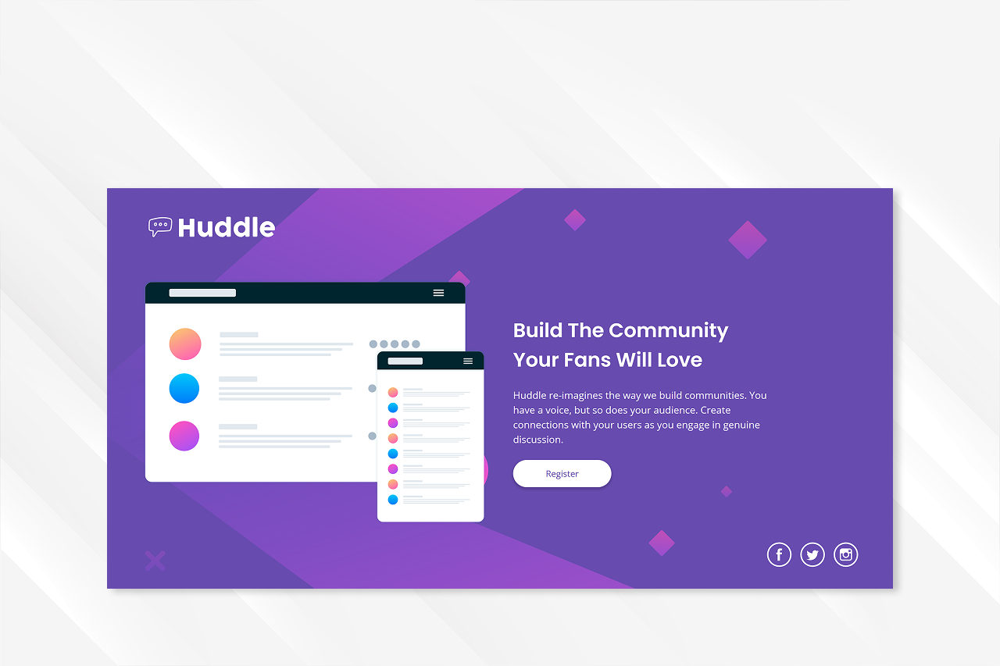
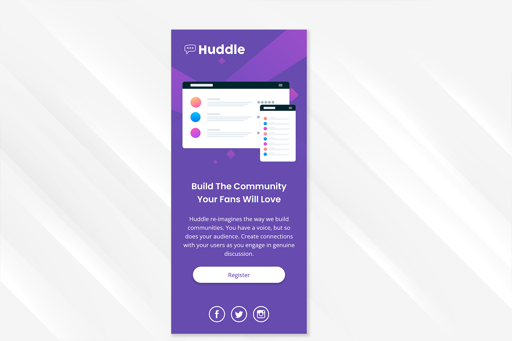

# 📌 Huddle landing page with single introductory section master

**Projeto desenvolvido a partir de um desafio do Frontend Mentor**

Landing page de seção única, desenvolvida com foco em responsividade e organização de layout.

---

## 🚀 Tecnologias utilizadas
- HTML5  
- CSS3  
- CSS Grid (`repeat()`)
- Responsividade fluida (`clamp()`, `vw`, `rem`)  
- SVG Sprite
- Mobile-First  
- Media Queries  

---

## 📱 Layout

A responsividade foi ajustada com breakpoints definidos nos pontos em que o layout apresentava quebra, garantindo consistência visual em diferentes resoluções para diferentes dispositivos.

---

## 🧩 O que foi praticado

- Melhoria na consistência da metodologia **BEM** e em nomenclaturas no HTML
- Melhor entendimento sobre a organização no css
- Melhora no design de landing pages

---

## 🖼️ Prévia do projeto (Desktop & Mobile)

### Desktop:

### Mobile:

---

## 🔗 Links
- **Projeto online:** https://daviwebdev.github.io/huddle-landing-page-with-single-introductory
- **Desafio:** https://www.frontendmentor.io/challenges/huddle-landing-page-with-a-single-introductory-section-B_2Wvxgi0

